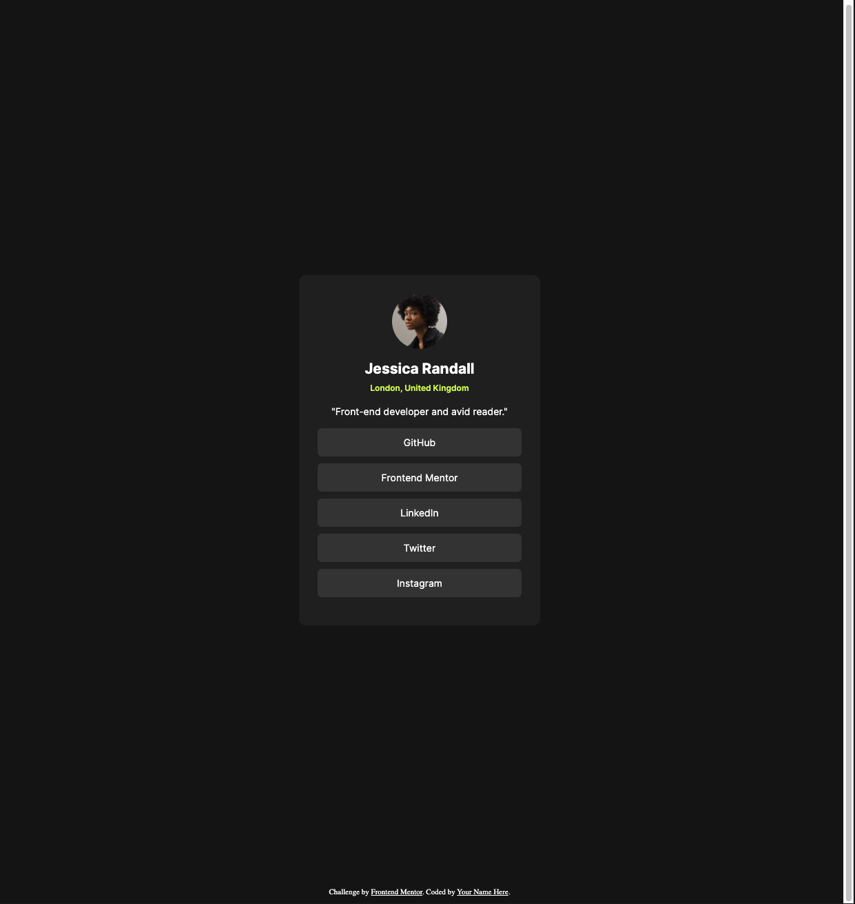

# Frontend Mentor - Social links profile solution

This is a solution to the [Social links profile challenge on Frontend Mentor](https://www.frontendmentor.io/challenges/social-links-profile-UG32l9m6dQ). Frontend Mentor challenges help you improve your coding skills by building realistic projects.

## Table of contents

- [Overview](#overview)
  - [The challenge](#the-challenge)
  - [Screenshot](#screenshot)
  - [Links](#links)
- [My process](#my-process)
  - [Built with](#built-with)
  - [What I learned](#what-i-learned)
  - [Useful resources](#useful-resources)
- [Author](#author)

## Overview

### The challenge

Users should be able to:

- See hover and focus states for all interactive elements on the page

### Screenshot

### Links

- Solution URL: [Github repo](https://github.com/mrcordova/social-links-profile)
- Live Site URL: [Github live page](https://mrcordova.github.io/social-links-profile/)

## My process

### Built with

- Semantic HTML5 markup
- CSS custom properties
- Flexbox
- CSS Grid

### What I learned

I learned how to add multiple pseudo classes in css.

### Useful resources

- [Add multiple selectors](https://stackoverflow.com/questions/34771974/associating-multiple-selectors-with-a-pseudo-class) -
  Saved me some time on writing css.

## Author

- Website - [Github repos](https://github.com/mrcordova)
- Frontend Mentor - [@mrcordova](https://www.frontendmentor.io/profile/mrcordova)
